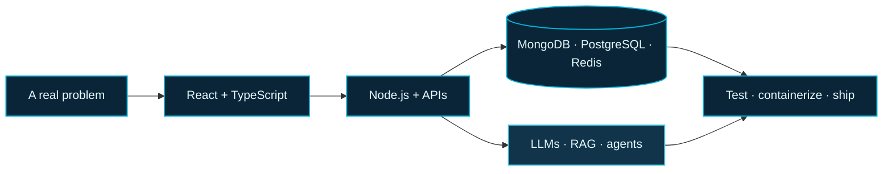

 

 

 
 

`MULTAN, PAKISTAN` &nbsp; / &nbsp; `MERN + TYPESCRIPT` &nbsp; / &nbsp; `AGENTIC AI`

---

<table>
<tr>
<td width="20%" align="center" valign="middle">

</td>
<td width="48%" valign="top">

## A little about me

I’m **Muhammad Shahzaib**, a full-stack developer working across the product stack: interfaces, APIs, databases, real-time systems, and deployment.

Lately, I’ve been building with **LLMs, retrieval-augmented generation, and agentic workflows**. I’m interested in AI that does more than answer a prompt: it should fit the product, work with real data, and behave reliably.

</td>
<td width="32%" valign="top">

### What I work on

`01` &nbsp; Full-stack applications  
`02` &nbsp; APIs and backend systems  
`03` &nbsp; RAG and AI integrations  
`04` &nbsp; Real-time features  
`05` &nbsp; Testing and deployment

</td>
</tr>
</table>

## The build path

## Work

<table>
<tr>
<td width="56%" valign="middle">

</td>
<td width="44%" valign="middle">

### AI marketplace

A multi-vendor store with role-based experiences, live order tracking, and an AI product assistant for natural-language discovery.

`REACT` `NODE.JS` `SOCKET.IO` `OPENAI` `REDIS`

[Portfolio gallery](https://devshahzaib.vercel.app/#work) ·
[Live build](https://ai-ecommerce-six.vercel.app/) · [Source](https://github.com/dev-mskhan/ai-ecommerce)

</td>
</tr>
</table>

<table>
<tr>
<td width="50%" valign="top">

### Dark Auction

Live bidding, tamper-evident bid history, and background jobs for auction media and notifications.

`SOCKET.IO` `REDIS` `BULLMQ`

[Open live project](https://dark-auction.vercel.app/) · [Portfolio gallery](https://devshahzaib.vercel.app/#work)

</td>
<td width="50%" valign="top">

### AI-powered CRM

A sales workspace with a Kanban pipeline, RAG-based enrichment, lead scoring, and assisted email drafting.

`RAG` `HUGGING FACE` `OLLAMA` `GROQ`

[Portfolio gallery](https://devshahzaib.vercel.app/#work)

</td>
</tr>
</table>

**More context, screens, and project notes live on my [portfolio](https://devshahzaib.vercel.app/).**

## Tools in my current toolkit

<table>
<tr>
<td width="25%" valign="top">

**BUILD**

</td>
<td width="25%" valign="top">

**DATA**

</td>
<td width="25%" valign="top">

**AI + SYSTEMS**

</td>
<td width="25%" valign="top">

**SHIP**

</td>
</tr>
</table>

## A few more coordinates

<table>
<tr>
<td width="50%" valign="top">

### Experience

**Backend AI Engineer Intern**  
FLyRankAI · July-August 2026

Full-stack freelance development across requirements, implementation, and deployment.

</td>
<td width="50%" valign="top">

### Education

**BS in Information Technology**  
Bahauddin Zakariya University, Multan  
2023-2027

</td>
</tr>
</table>

---

### Have a thoughtful product problem?

I’m open to **remote roles, internships, and contract work**.

[See what I build](https://devshahzaib.vercel.app/) &nbsp; · &nbsp; [Connect on LinkedIn](https://linkedin.com/in/shahzaibkhan45) &nbsp; · &nbsp; [Email me](mailto:dev.mskhan@gmail.com)

 

Built with curiosity, careful systems, and a little ocean blue.

